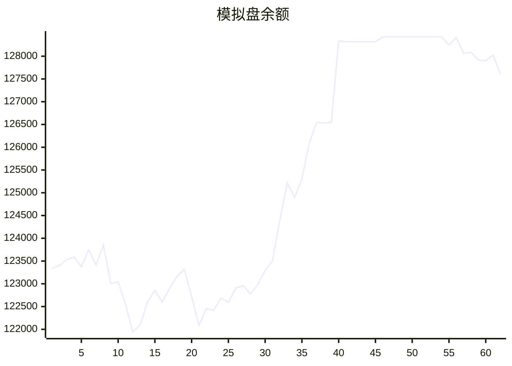

# 📈 AI模拟盘 自动交易报告

## 资产明细
- **BTC**: $5102.5
- **ETH**: $68442.0
- **SOL**: $5147.8
- **USDT**: $48918.9

## 交易记录
- 2025-11-10T12:41:22.039539 - Buy 0.5 ETH at $3550, Buy 0.01 BTC at $104500, Buy 10 SOL at $168
- 2025-11-10T11:18:33.930728 - Buy 5 ETH at market ~$18000
- 2025-11-10T11:18:33.930725 - Sell 0.05 BTC, took profit ~$5300
- 2025-11-10T11:06:15.309874 - Buy 10 SOL at $165, Buy 10 SOL at $163, Buy 5 SOL at $162 - Total 25 SOL for $4,025
- 2025-11-10T09:26:33.453568 - Sold 10 ETH, received 0.4634 ETH in SOL
- 2025-11-10T09:26:33.453565 - Buy 6.5309 SOL-ETH, avg price 0.04654 ETH
- 2025-11-10T07:27:26.359694 - Buy 6.4 ETH at avg price $3617.9958, spent $23188.94
- 2025-11-10T06:30:56.868173 - Sold 3 SOL for market price, reducing exposure to overbought conditions
- 2025-11-10T06:30:56.868171 - Bought 0.5 ETH at market price, taking advantage of dip
- 2025-11-10T06:30:56.868168 - Sold 0.2 BTC for market price, locking profits

## 相关链接
- https://t.me/s/mcpBtc
- [工作流运行记录](https://github.com/aahl/mcp-aktools/actions/workflows/trading-claude.yaml)
