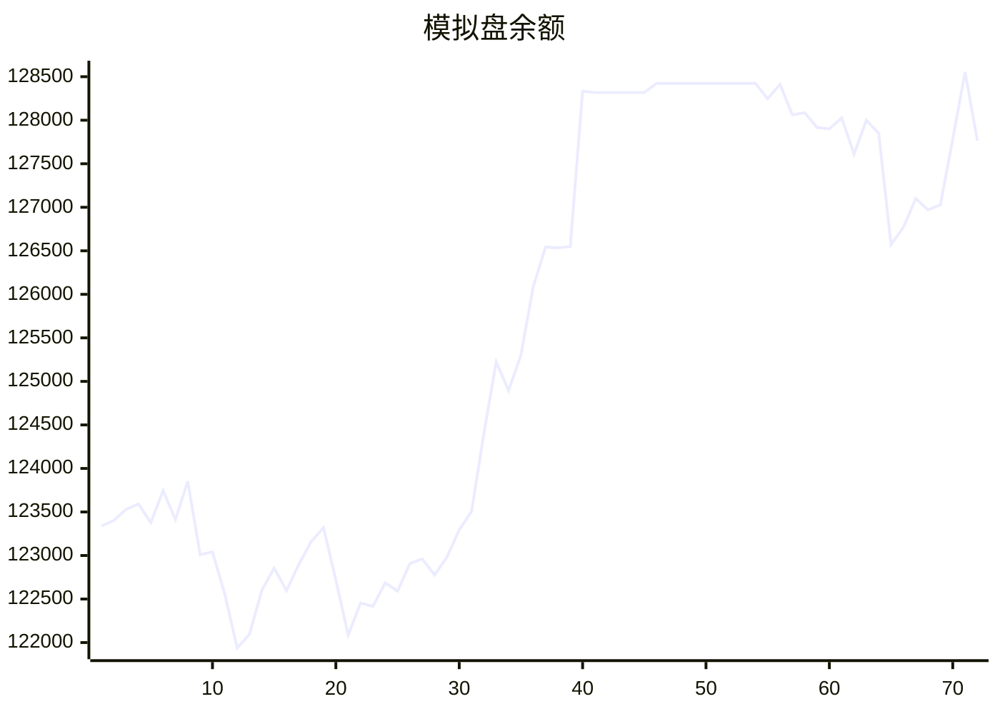

# 📈 AI模拟盘 自动交易报告

## 资产明细
- **BTC**: $30844.2
- **ETH**: $510.6
- **SOL**: $262.6
- **USDT**: $53533.3

## 交易记录
- 2025-11-11T04:27:54.853368 - Buy 2.94 SOL-USDT, spent 500 USDT
- 2025-11-11T04:27:54.853364 - Buy 0.1 ETH-USDT, spent 1000 USDT
- 2025-11-11T03:20:38.766146 - Buy 10 USDT SOL, executed order 3030931242931978240
- 2025-11-11T03:20:38.766143 - Buy 100 USDT ETH, executed order 3030928552638283776
- 2025-11-11T01:18:56.241748 - Sell 15 SOL-USDT at market price
- 2025-11-10T21:22:24.116991 - Sell 5 SOL at 166.38 USDT
- 2025-11-10T21:22:24.116988 - Buy 0.00014 ETH at 3547.03 USDT
- 2025-11-10T19:22:06.174559 - ETH entry price: $3600.34, SOL entry price: $166.42
- 2025-11-10T19:22:06.174557 - BTC order failed due to minimum amount
- 2025-11-10T19:22:06.174553 - Buy 0.5 ETH-USDT, Buy 10 SOL-USDT

## 相关链接
- https://t.me/s/mcpBtc
- [工作流运行记录](https://github.com/aahl/mcp-aktools/actions/workflows/trading-claude.yaml)
