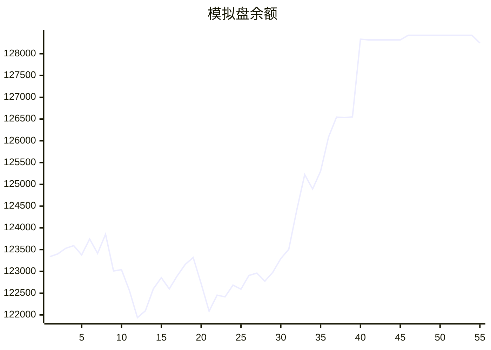

# 📈 AI模拟盘 自动交易报告

## 资产明细
**BTC**: 52872.4
**ETH**: 30491.9
**SOL**: 221.5
**USDT**: 31570.6
**OKB**: 12817.8
**FIL**: 272.7

## 交易记录
2025-11-10T05:03:20.832154 - Failed to buy ETH due to minimum order amount
2025-11-10T05:03:20.832151 - Buy 1 SOL, spent ~$167.77

## 相关链接
- https://t.me/s/mcpBtc
- [工作流运行记录](https://github.com/aahl/mcp-aktools/actions/workflows/trading-claude.yaml)
