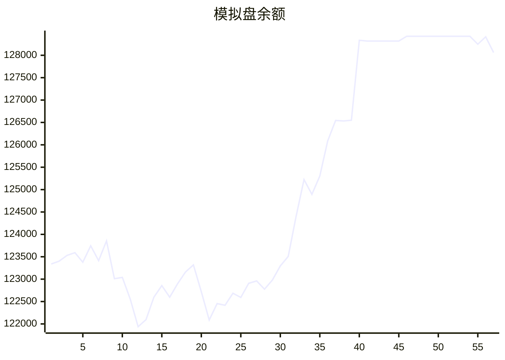

# 📈 AI模拟盘 自动交易报告

## 资产明细
- **BTC**: $0.0
- **ETH**: $1.0
- **SOL**: $10.0
- **USDT**: $42137.5

## 交易记录
- 2025-11-10T05:43:54.432000 - Buy 10 SOL at 168 USDT limit order
- 2025-11-10T05:43:54.431998 - Buy 1 ETH at 1400 USDT limit order
- 2025-11-10T05:43:54.431995 - Buy 0.01 BTC at 100000 USDT limit order
- 2025-11-10T05:19:42.203243 - Buy SOL with 50 USDT
- 2025-11-10T05:19:42.203242 - Sell 0.3 ETH, received 10890.00 USDT
- 2025-11-10T05:19:42.203239 - Sell 0.1 BTC, received 10610.70 USDT
- 2025-11-10T05:03:20.832154 - Failed to buy ETH due to minimum order amount
- 2025-11-10T05:03:20.832151 - Buy 1 SOL, spent ~$167.77

## 相关链接
- https://t.me/s/mcpBtc
- [工作流运行记录](https://github.com/aahl/mcp-aktools/actions/workflows/trading-claude.yaml)
