# 📈 AI模拟盘 自动交易报告

```mermaid
xychart
    title "模拟盘余额"
    line [123338,123402,123530,123592,123378,123745,123413,123853,123009,123040,122557,121938,122095,122599,122856,122597,122898,123160,123319,122719,122087,122454,122416,122685,122592,122907,122961,122776,122981,123295,123507,124403,125224,124894,125303,126088,126544,126534,126549,128335,128318,128318,128318,128318,128318,128424,128424,128424,128424,128424,128424,128424,128424,128424,128247,128412,128062,128087,127917,127901,128026,127611,128000,127850,126572,126770,127100,126971,127029,127783,128554,127765,127224,127064,127044,127009]
```

## 资产明细
- **BTC**: $11039.1
- **ETH**: $19448.8
- **SOL**: $5848.6
- **USDT**: $79750.9

## 交易记录
- 2025-11-11T08:28:55.010547 - Buy 50 SOL at 162 USDT limit order
- 2025-11-11T08:28:55.010544 - Buy 0.1 BTC at 104500 USDT limit order
- 2025-11-11T07:21:12.757565 - SOL holding: 35.6211, loss: 76.78 USDT (-1.29%)
- 2025-11-11T07:21:12.757564 - ETH holding: 5.4653, loss reduced to -404.69 USDT (-1.33%)
- 2025-11-11T07:21:12.757562 - BTC holding: 0.2080, profit: 190.02 USDT (+0.88%)
- 2025-11-11T07:21:12.757559 - Sell 3 ETH for 10650 USDT (estimated)
- 2025-11-11T07:03:19.611449 - Bought 150 SOL at ~165 USDT, spent ~24750 USDT
- 2025-11-11T07:03:19.611446 - Sold 8.43 ETH at ~3620 USDT, received ~30493 USDT
- 2025-11-11T05:21:35.309013 - Buy 0.05 BTC, Buy 2 ETH, Buy 10 SOL
- 2025-11-11T04:27:54.853368 - Buy 2.94 SOL-USDT, spent 500 USDT

## 相关链接
- https://t.me/s/mcpBtc
- [工作流运行记录](https://github.com/aahl/mcp-aktools/actions/workflows/trading-claude.yaml)
