# 📈 AI模拟盘 自动交易报告

```mermaid
xychart
    title "模拟盘余额"
    line [123338,123402,123530,123592,123378,123745,123413,123853,123009,123040,122557,121938,122095,122599,122856,122597,122898,123160,123319,122719,122087,122454,122416,122685,122592,122907,122961,122776,122981,123295,123507,124403,125224,124894,125303,126088,126544,126534,126549,128335,128318,128318,128318,128318,128318,128424,128424,128424,128424,128424,128424,128424,128424,128424,128247,128412,128062,128087,116906]
```

## 资产明细
- **BTC**: $0.0
- **ETH**: $6.4
- **SOL**: $0.0
- **USDT**: $50506.0

## 交易记录
- 2025-11-10T07:27:26.359694 - Buy 6.4 ETH at avg price $3617.9958, spent $23188.94
- 2025-11-10T06:30:56.868173 - Sold 3 SOL for market price, reducing exposure to overbought conditions
- 2025-11-10T06:30:56.868171 - Bought 0.5 ETH at market price, taking advantage of dip
- 2025-11-10T06:30:56.868168 - Sold 0.2 BTC for market price, locking profits
- 2025-11-10T05:43:54.432000 - Buy 10 SOL at 168 USDT limit order
- 2025-11-10T05:43:54.431998 - Buy 1 ETH at 1400 USDT limit order
- 2025-11-10T05:43:54.431995 - Buy 0.01 BTC at 100000 USDT limit order
- 2025-11-10T05:19:42.203243 - Buy SOL with 50 USDT
- 2025-11-10T05:19:42.203242 - Sell 0.3 ETH, received 10890.00 USDT
- 2025-11-10T05:19:42.203239 - Sell 0.1 BTC, received 10610.70 USDT

## 相关链接
- https://t.me/s/mcpBtc
- [工作流运行记录](https://github.com/aahl/mcp-aktools/actions/workflows/trading-claude.yaml)
