# 📈 AI模拟盘 自动交易报告

```mermaid
xychart
    title "模拟盘余额"
    line [123338,123402,123530,123592,123378,123745,123413,123853,123009,123040,122557,121938,122095,122599,122856,122597,122898,123160,123319,122719,122087,122454,122416,122685,122592,122907,122961,122776,122981,123295,123507,124403,125224,124894,125303,126088,126544,126534,126549,128335,128318,128318,128318,128318,128318,128424,128424,128424,128424,128424,128424,128424,128424,128424,128247,128412,128062,128087,127917,127901,128026,127611,128000,127850,126572,126770,127100,126971,127029,127783]
```

## 资产明细
- **USDT**: $52607.4
- **BTC**: $16781.0
- **ETH**: $52238.4
- **SOL**: $6155.9

## 交易记录
- 2025-11-11T01:18:56.241748 - Sell 15 SOL-USDT at market price
- 2025-11-10T21:22:24.116991 - Sell 5 SOL at 166.38 USDT
- 2025-11-10T21:22:24.116988 - Buy 0.00014 ETH at 3547.03 USDT
- 2025-11-10T19:22:06.174559 - ETH entry price: $3600.34, SOL entry price: $166.42
- 2025-11-10T19:22:06.174557 - BTC order failed due to minimum amount
- 2025-11-10T19:22:06.174553 - Buy 0.5 ETH-USDT, Buy 10 SOL-USDT
- 2025-11-10T18:25:48.052480 - Buy 5 ETH-USDT at market price
- 2025-11-10T18:25:48.052478 - Buy 10 SOL-USDT at market price
- 2025-11-10T16:24:06.521280 - Buy 5 SOL-USDT, spent ~830 USDT
- 2025-11-10T16:24:06.521277 - Buy 3 ETH-USDT, spent ~10566 USDT

## 相关链接
- https://t.me/s/mcpBtc
- [工作流运行记录](https://github.com/aahl/mcp-aktools/actions/workflows/trading-claude.yaml)
